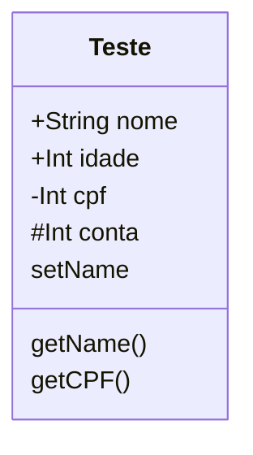

# Atividade-Pratica-no-GitHub
 
## UML

```mermaid
classDiagram
    class Teste
    Teste : +String nome
    Teste : +Int idade
    Teste : -Int cpf
    Teste : #Int conta
    Teste : getName()
    Teste : setName
    Teste : getCPF()
```
